# Theater Panel

A wall-panel app for the home theater: browse Plex and play on the projector, request titles
through Seerr, run Music Assistant, and control the room's lights and scenes. It is built for a
1920x1080 Android panel running [Kiosk Satellite](../kiosk-satellite), and scales to fit any
other screen.

It runs as its own container, next to Plex and Seerr, so it adds no load to Home Assistant. HA
still does the room logic: every button calls a `theater_*` script from `ha/theater.yaml`, so
the same scenes work from Pico remotes, voice and the HA app.

```
Kiosk Satellite ──http──▶ theater-panel ──▶ Plex        (library, posters, history, sessions)
  (1920x1080 panel)         (this repo)  ──▶ Seerr       (search, requests, queue, TMDB)
                                         ──▶ Home Assistant (one websocket, ~15 entities,
                                              theater_* scripts, Music Assistant actions)
```

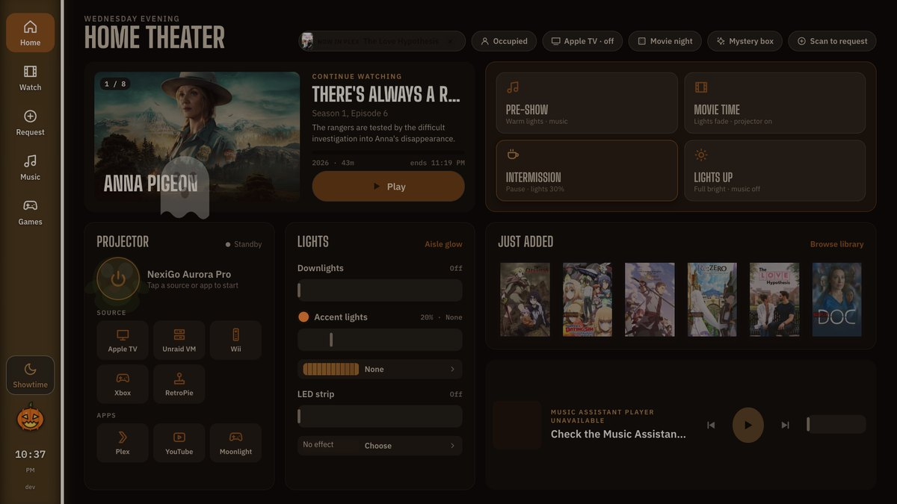

## Screens

| Screen | What it does |
|---|---|
| **Home** | Continue watching (Plex on deck), scenes, projector power, lights, just added, music bar |
| **Watch** | Plex libraries as a poster grid with 4K / HDR / Atmos badges and filters (unwatched, under 2 hours, family friendly, 4K, HDR, random pick), browse by network, "You'll love this", details, subtitles, "ends at" time, Play on projector |
| **Request** | Seerr trending, upcoming (with release dates), what's streaming on each network, and search; request sheet (seasons, 1080p/4K), your request queue with download progress |
| **Games** | Console and PC buttons (HDMI switcher and projector input, through Home Assistant), Steam library with launch, gaming PC stats from HA |
| **Music** | Music Assistant now playing, albums/playlists/artists/radio, search, queue, which player to use |
| **Showtime** | The dark screen while something plays: pause, skip, volume, intermission, lights up, sleep timer. Opens by itself when the Apple TV starts playing and dims the panel's backlight through Kiosk Satellite. |
| **Intermission** | The break: a 1950s drive-in snack bar with a marquee, a countdown and the concessions marching past, while a march plays in the room |
| **Year in review** | The house's year out of Plex's history: hours, the top ten, who watched what, the longest sitting |
| **Now Showing** | After a few idle minutes the panel drifts to a poster wall of what's in progress, what just arrived and what is on its way. Any touch brings it back. |

<p>
  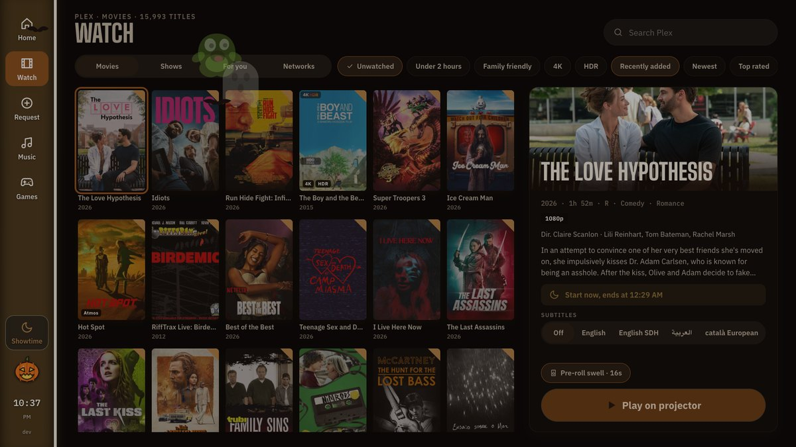
  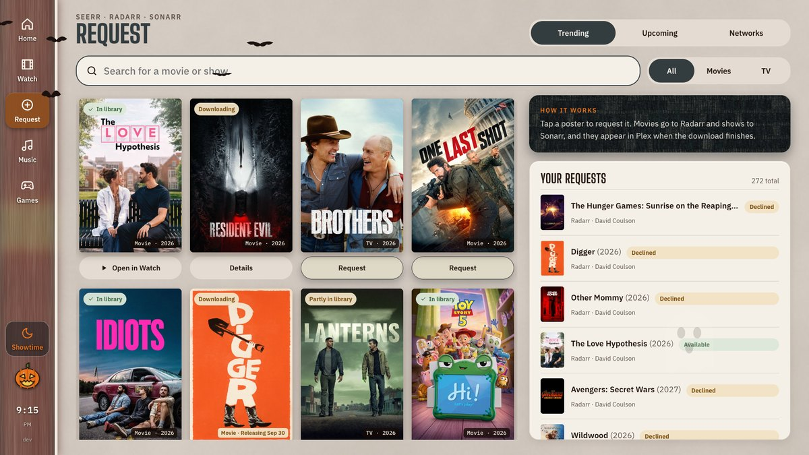
  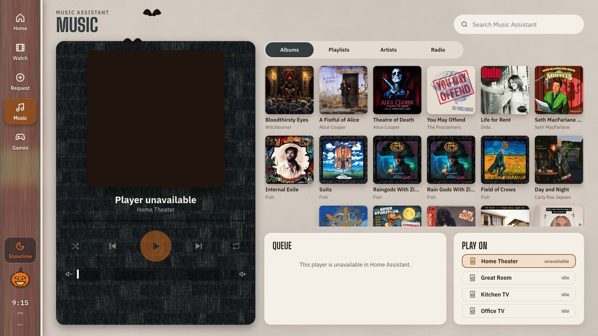
</p>

Deep links work for everything, e.g. `#/watch?brand=netflix`, `#/request?mode=upcoming`,
`#/games`, `#/lobby?mystery=1`, which HA can send through `esphome.theater_panel_navigate`.

## Picking something

Three ways in, for three different moods.

**You'll love this** (Watch > For you) reads Plex's own watch history, takes the last few things
the house actually finished, and asks TMDB through Seerr what goes with them. Anything already in
the library says **In Plex** and plays like any other title; anything missing says **Request** and
opens the request screen with the name filled in. No Trakt account and no second service to keep
signed in.

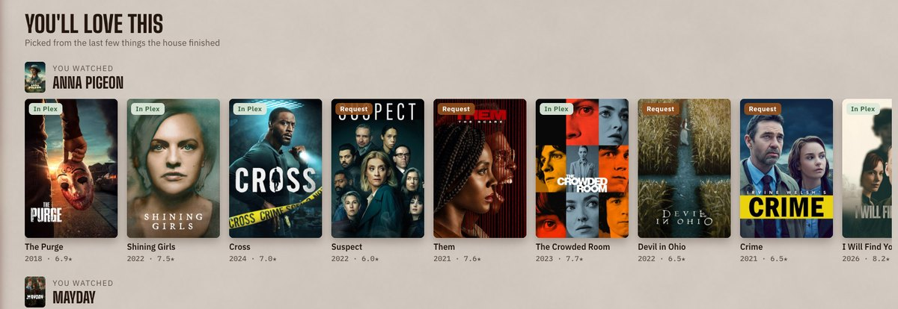

**On your watchlist** sits above it once a Plex account is signed in (Connections > Plex
account; a plex.tv sign-in with the panel never seeing the password). Anything on the account's
plex.tv watchlist that is already in the library plays from here; anything not yet in it goes to
the request screen.

**The Mystery box** picks one unwatched film, weighted towards the genres the house has been
watching, and starts it. It says why it chose that one, counts down from ten, and takes
*Something else* or *Not tonight* for an answer.

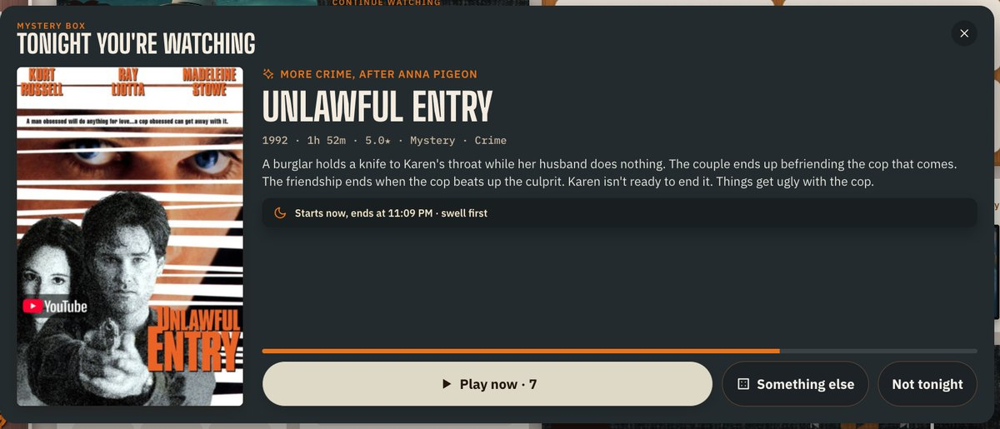

**Movie night** (`#/pick`) puts a shortlist on the panel and a QR on screen; everyone votes from
their phones at `/vote` and the tally comes back live. In October and at Christmas the
shortlist comes from that season's shelf ("Three from Halloween Scares"), with a chip to go back
to the whole library.

**Surprise me.** "Hey Jarvis, surprise me" (or *pick something*, *what should we watch*) makes the
server choose, opens the box on every panel in the room and reads the title back. The sentences
are in `ha/custom_sentences/en/theater.yaml`.

**Year in review** (`#/year`, or the chip on the For you tab) counts the house's year out of
Plex's history: hours, plays, the ten it kept coming back to, who watched what, the busiest month
and the longest sitting. Plays are exact; hours are an estimate, because history records that
something was watched, not for how long.

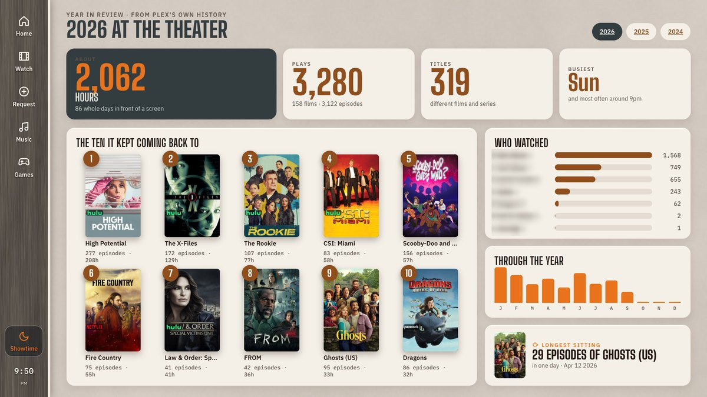

Once a year the review comes to your phone: on the date under Display > Year in review (the
26th of December unless changed) the panel sends a one-paragraph summary of the year - hours,
the top title, the longest sitting - to the Home Assistant `notify` targets listed there.
*Send it now* on that page tries it out.

Set **Whose taste to follow** on the settings page (Plex > account names) to keep the
recommendations out of the kids' anime; blank follows the whole house.

## Before, during and after the film

**The pre-roll swell.** With a sound set under Projector apps, Play sends a deep swell to the
theater speakers, drops the downlights over eight seconds and starts the film when it finishes.
`tools/deep-swell.py` synthesises the panel's own 17-second version (30 detuned sawtooth voices
sliding into a very wide D major) - our own take on the idea, not anybody's recording. Films get
it, episodes don't, and the Play button decides for the title in front of you.

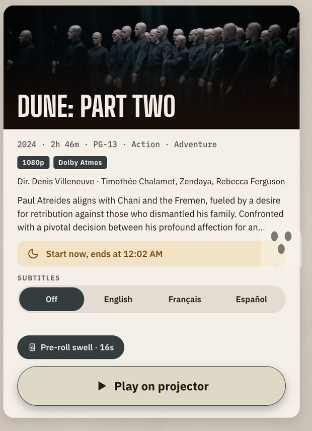

**The sleep timer.** *After this* turns the room off when playback ends; 30, 60 or 90 minutes
stops it and turns everything off then. The server holds the timer, not the panel, so it still
works after the panel reloads, drifts to the idle screen or is switched off.

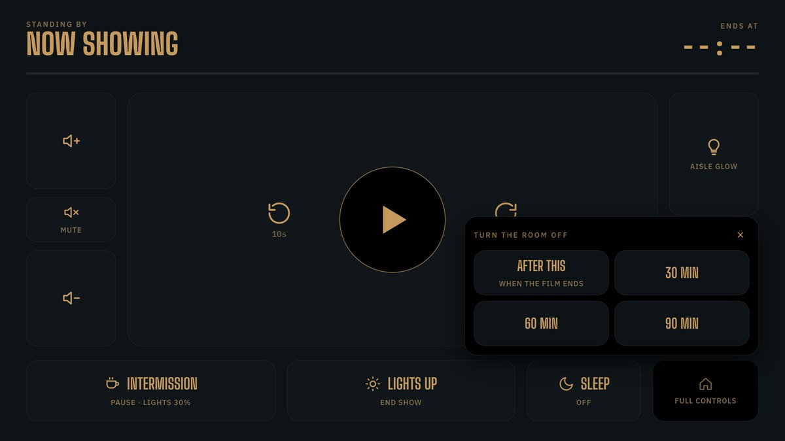

**The slow curtain.** When the film ends and no sleep timer is armed, the house lights come up
over ninety seconds the way a cinema's do, rather than snapping on. `script.theater_curtain` only
acts if the room is still set for a movie, so stopping something at lunchtime does nothing.
`CURTAIN_SECONDS=0` turns it off.

**Intermission.** Call for a break - from the panel, a remote, or "hey Jarvis, intermission" -
and the wall turns into a 1950s drive-in snack bar: a marquee, a countdown, and the concessions
marching past on stick legs while a corny little march plays in the room. Both the march and the
cast are the panel's own (`tools/snipes.py` and `web/lib/snacks.mjs`); the 1957 reel is somebody
else's film. The parade dresses for the season, too.

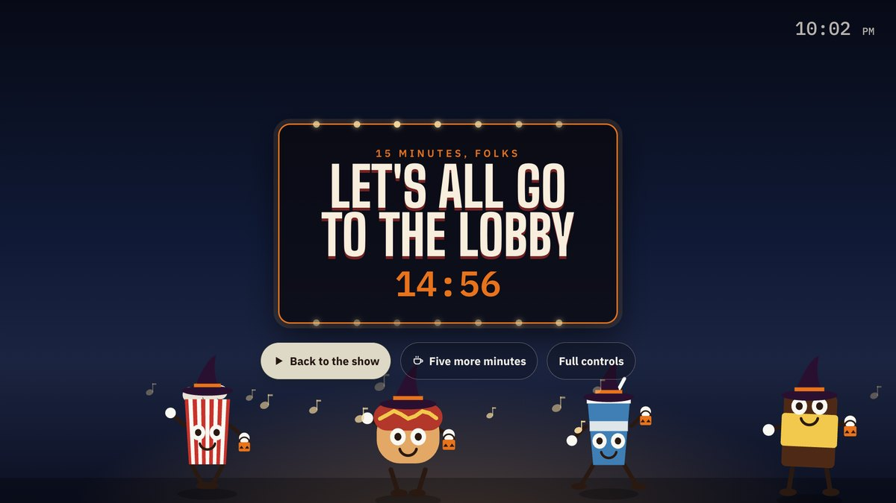


**How was it?** When a film runs to the end, the panel asks on the way out: five stars, and
everyone on the sofa can tap. The card keeps the tally and Plex is told the *average*, so one
person's five doesn't stand for the room. The stars feed back: films the house rated four or
five lead the "You'll love this" rows and count double in the Mystery box, and the genres of
what it rated two or under are marked down. Skip takes no for an answer, and the card goes by
itself after twenty minutes.

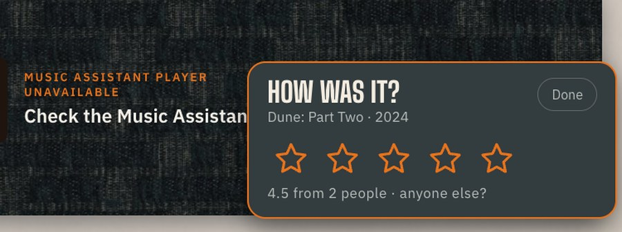

**The dog at the deck door.** When UniFi hears barking or sees an animal on the deck camera, a
card with a snapshot appears - even over a film - with a button to let her in.

## Cinema mode

The room is dark but nothing is playing - the break, the credits, someone deciding what's next -
and a cream panel on the wall lights the whole room. Cinema mode drops the panel to a dark
palette instead, and puts a wash over everything so posters and artwork come down with it. It
follows the room by itself: the Movie time and Intermission scenes, or the downlights below 25%
with the accent lights up, and it lifts when the lights do. `#/lobby?cinema=1` pins it on one
panel; Display > "Dim the panel when the room is dark" turns the idea off.

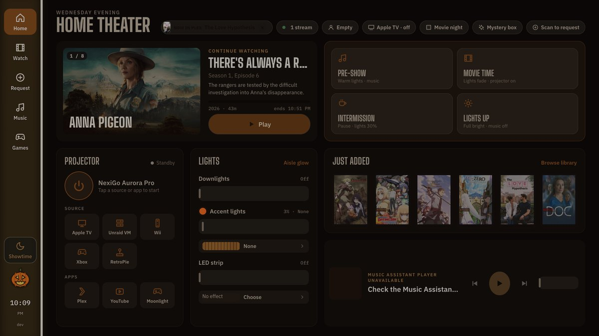

## Holidays and seasons

Two independent axes: the **theme** (the room as built, or the couch's slate tweed) and an
**accent** on top of it. Accents follow the house calendar by themselves - Halloween all October,
Thanksgiving from the Saturday before, Christmas from the Friday after Thanksgiving to the 30th,
New Year's Eve, birthdays - or can be pinned on the settings page. Each one brings its own
highlight colour, an idle glow on the light strip, a glyph by the clock and a little weather over
the lobby: bats and ghosts, falling leaves, petals, confetti, snow that piles up on the tops of
the cards and melts away again. At Christmas there are snowmen in the drifts, a sleigh with
coloured reindeer and a glitter wake, a lit tree on the idle screen, and Santa, who comes up from
behind the snow every so often to wave.

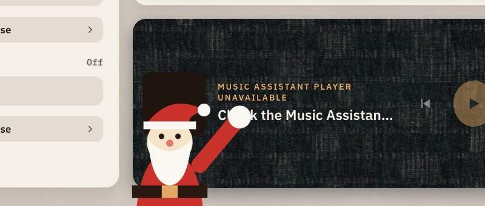

**Accent weather** (0-100%) on the settings page decides how much of it there is. Kiosk
Satellite's plugin publishes theme, accent and weather as Home Assistant entities, so an
automation can dress the panel up too.


At Halloween the idle board becomes a **creature feature**: a green B-movie title card, a print
that flickers, and the pre-roll swaps its swell for a sting - a low pedal, a theremin wail and
two organ stabs (`web/assets/preroll-spooky.mp3`, also ours).


## Run it

```bash
cp .env.example .env    # fill in HA, Plex and Seerr
docker compose up -d
```

With Traefik, the panel is at `https://ht-kiosk.coulson.io` (set `PANEL_HOST`, `TRAEFIK_NETWORK`,
`TRAEFIK_ENTRYPOINT` and `TRAEFIK_CERTRESOLVER` in `.env` to match your Traefik). Without it,
open `http://<host>:8787`. Set that URL as Kiosk Satellite's start URL.

The live updates use Server-Sent Events, which Traefik passes through as-is; don't put a
buffering or compression middleware on this router.

For development without Docker: `npm install` and `npm run dev` (Node 22 or newer).

### Settings page

Set `ADMIN_PASSWORD` on the container and open `/admin` (e.g. `https://ht-kiosk.coulson.io/admin`)
from a laptop. It has a menu down the left: Overview, Connections (Home Assistant, Plex, Seerr),
Room (entities, lights), Projector apps (and the pre-roll), Display (theme, accent, weather,
birthdays) and Access. Everything the panel does can be changed there and it picks changes up
without a restart. Saved values live in `settings.json` in the container's `/data` volume and win
over the container's environment; a blank field falls back to it. Secrets are write-only.

### Unraid

Copy [unraid/theater-panel.xml](unraid/theater-panel.xml) to
`/boot/config/plugins/dockerMan/templates-user/my-theater-panel.xml`, then Docker > Add Container >
Template: theater-panel. The image is `ghcr.io/davidcoulson/theater-panel:latest`; Unraid shows an
update whenever a new one is pushed, and the Auto Update Applications plugin can apply it.

Publish with `npm run push`. It builds amd64 and arm64 with Docker (not OCI) manifest types and no
attestations: Unraid's update check can't read an OCI index and reports "not available".

## The panel as a Home Assistant device

The panel speaks the ESPHome native API (through [esphome-device](https://github.com/davidcoulson/esphome-device)),
so Home Assistant's own ESPHome integration adds it like a board, with no MQTT and no custom
integration. **Settings → Devices & services → Add integration → ESPHome**, then the container's
address and port 6053 (the settings page can change the port and set a Noise encryption key).

What it exposes:

- **Controls:** theme, holiday accent and accent weather (the same as `/api/look`), cinema mode
  and pre-roll switches, the sleep timer as a select, and buttons for the scenes, the Mystery box
  and "Surprise me" (picks and starts a film).
- **Sensors:** now playing, playback progress, film playing, Plex streams, panels open, the
  active accent and the build; an update entity that compares the running build with GHCR
  (its Install button fires the `esphome.theater_panel_update_requested` event for an automation
  to act on, since Unraid pulls the image, not the panel).
- **Actions:** `esphome.theater_panel_play` (`rating_key`, `part_id`, `preroll`),
  `esphome.theater_panel_navigate` (`route`), `esphome.theater_panel_voice` (`intent`, `query`)
  and `esphome.theater_panel_scene` (`name`). `ha/theater.yaml` uses these; there are no
  `rest_command`s or REST sensors any more, so nothing on the HA side needs the panel key. An
  action returns nothing, so the voice intents wait for the **Voice answer** sensor and speak it.
- **Event:** `mystery_box_pick` fires when a pick goes up on the panels.

## Home Assistant setup

1. Copy `ha/theater.yaml` to `/config/packages/` (with `packages: !include_dir_named packages`
   under `homeassistant:`), then restart HA.
2. Create a long-lived access token, ideally for a dedicated non-admin user, and put it in `HA_TOKEN`.
3. For playback: in Plex on the Apple TV, turn on **Advertise as player**, open Plex, press
   **Scan clients** on the Plex integration, and set `ENTITY_PLEX_PLAYER` to the new entity.
4. Kiosk Satellite (fork build 2026.9.69-djc-2026.09.21.04 or later) opens a Home Assistant
   **Webpage dashboard** whose URL is this panel (https://ht-kiosk.coulson.io), with HA kiosk mode
   hiding the header and sidebar. Voice Satellite runs in the HA page around the panel. In KS,
   set **Page allowed from a frame** to exactly `https://ht-kiosk.coulson.io` so the HA page
   relays theater mode to the panel. `FRAME_ANCESTORS` must include HA's origin
   (`https://home-iot.coulson.io`), and Traefik must not add an `X-Frame-Options: DENY` header.

### Kiosk Satellite theater mode

Showtime turns Kiosk Satellite's theater mode on when it appears and off when it goes (through
the HA page's relay when framed, or the bridge directly when the panel is a top-level page): the
backlight drops to its minimum under a native black wash, the first touch only wakes the
screen (so a finger in the dark can't hit Stop), and a peek lasts 8 s after the last touch.
Announcements and camera popups still show. The app restores brightness itself, even after a
crash. If theater mode is switched on from elsewhere (HA's `switch.…_theater_mode`, a
`ks://theater` link, or a reload mid-film), the panel jumps to Showtime.

HA moves the panel between its screens with `esphome.theater_panel_navigate` and
`route: "#/showtime"` (or `#/watch?brand=netflix`, `#/games`...), which pushes the route to every
open panel over its live connection; nothing reloads. (Kiosk Satellite's `navigate` service moves
the HA dashboard around the panel instead.)
In an ordinary browser there is no theater mode and Showtime simply dims its own controls.

## Games

Copy `config/games.example.json` to `config/games.json` (mounted read-only into the container).
Consoles behind the HDMI switcher are switched through its Home Assistant select entity, from
the [OREI HDMI switch integration](https://github.com/davidcoulson/ha-orei-ukm) for the UKM-401:
each source's `option` must match an input name set in that integration's options. Sources
wired straight to the projector (the Windows VM on HDMI 2) set `projectorInput` instead. Add the
PC's HA entities (power, stats sensors, and a script that launches a Steam game with `appid`)
under `pc`, and `STEAM_API_KEY` / `STEAM_ID` to `.env` for the library. The panel never talks to
the hardware itself; everything goes through Home Assistant.

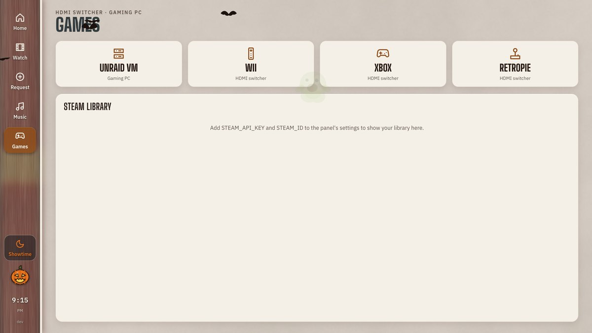

## The basement panel

`web/basement/` is a second, much smaller panel for the 5" 1280x800 screen on the basement
stairs: light zones on a split dial (brightness on one side, colour temperature on the other) and
a moods page, served to Home Assistant as a custom Lovelace card. `node tools/basement-sync.mjs`
assembles it; `web/basement.html` holds the original mockups.

## What is not finished

- **Projector input and picture mode.** Power works through the Apple TV (HDMI-CEC). Input and
  picture mode need the Aurora Pro's ADB commands, which have not been tested yet; the scripts
  post a notification instead of guessing. Set `ENTITY_PROJECTOR` once the ADB integration is set up.
- **Games hardware.** The HDMI switcher's serial commands, the projector input names and the
  Windows VM's HA entities are placeholders in `games.example.json` until they are known, so the
  gaming PC's stats page is still demo data.
- **Music Assistant "Home Theater" player** is unavailable in HA, so the music bar shows that.
- Subtitles can be chosen before playing (stored on the Plex item). Changing them mid-movie
  is not possible through the Apple TV's HA integration.
- The basement card does not follow the theme and accent system yet.

## Layout

```
server/   Node http server, no framework: Plex, Seerr, HA websocket, image cache, SSE,
          taste (recommendations, mystery box), sleep timer, accents calendar
web/      Preact + htm as plain ES modules (no build step), styles, room textures
ha/       Home Assistant package: scenes, play sequence, pre-roll, playback automation
tools/    shot.mjs (screenshots via local Chrome), deep-swell.py (the pre-roll sound),
          textures.py (regenerates textures), basement-sync.mjs (builds the basement card)
docs/img/ the screenshots in this file
```

Dependencies: preact, htm and three @fontsource font packages. Fonts, textures and scripts are
all served locally, so the panel loads nothing from the internet.
